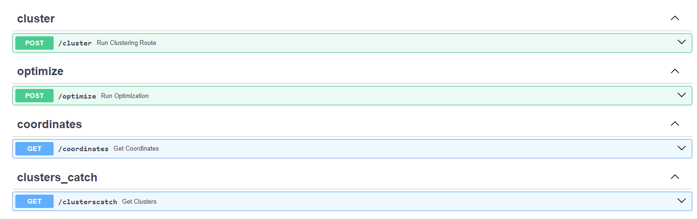
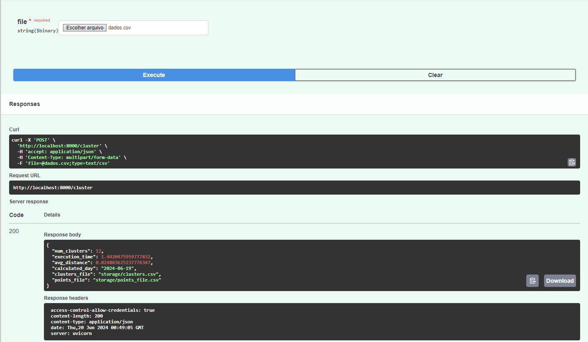
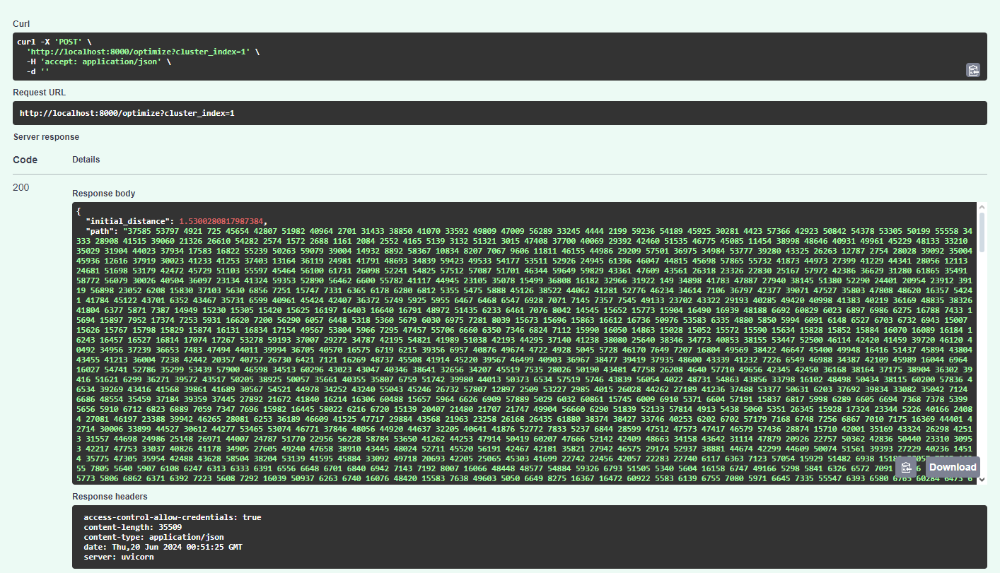
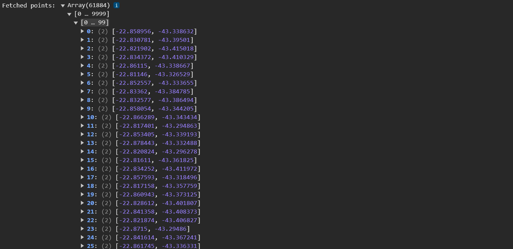
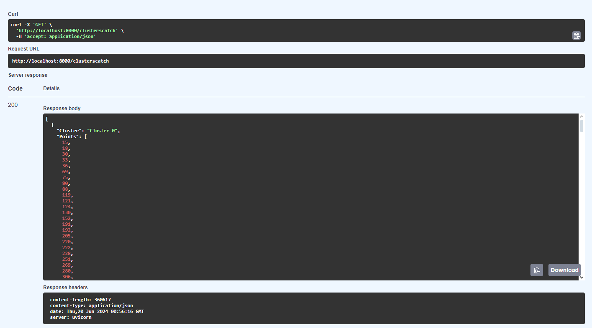

# Documentação Backend

&emsp;Para o problema de otimização de rotas apresentado pela Aegea, o grupo optou por utilizar um backend rápido e eficiente para lidar com uma quantidade significativa de dados. FastAPI é um framework moderno e de alta performance para construir APIs com Python. Ele é fácil de usar e rápido para desenvolvimento, com validações automáticas e geração de documentação interativa. FastAPI segue os princípios do código limpo, oferecendo uma estrutura robusta para criar aplicações escaláveis e eficientes.

&emsp;Abaixo estão listadas as rotas utilizadas na aplicação:
- Upload de dados;
- Clusterização dos dados;
- Obtenção de coordenadas;
- Obtenção de clusters;
- Algoritmo de otimização de rotas para um cluster específico.

 Imagem 1 - Rotas endpoint 

  

## Upload de Dados
&emsp;O upload de dados é realizado assim que o usuário entra na aplicação e realiza a inserção de um arquivo '.csv' para que seja calculado as rotas.

- Método: `POST`
- Rota: `cluster`
- Parâmetros: `file` -> arquivo que o usuário irá enviar para a aplicação
- Resposta: 
    - `info`: Mensagem confirmando o sucesso do upload;
    - `num_clusters`: Número de clusters identificados;
    - `execution_time`: Tempo de execução do algoritmo;
    - `avg_distance`: Distância média entre os pontos e o centroide do cluster;
    - `calculated_day`: Data de execução;
    - `clusters_file`: Caminho do arquivo contendo a informação dos clusters;
    - `points_file`: Caminho do arquivo contendo a informação dos pontos.

 Imagem 2 - Upload de Arquivos 

  

## Otimização de Rotas
&emsp;Este endpoint executa o algoritmo de otimização de rotas para um cluster específico, retornando a distância inicial e o caminho otimizado.

- Método: `POST`
- Rota: `optimize`
- Parâmetros: `cluster_index` -> Índice do cluster a ser otimizado
- Resposta: 
    - `initial_distance`: Distância inicial antes da otimização;
    - `path`: Caminho otimizado dos pontos dentro do cluster.

 Imagem 3 - Otimização 

  

## Obtenção de Coordenadas
&emsp;Esta rota fornece as coordenadas dos pontos de leitura a partir do arquivo CSV de pontos.

- Método: `GET`
- Rota: `coordinates`
- Resposta: Lista de duplas de coordenadas (LATITUDE, LONGITUDE)

 Imagem 4 - Obtenção de Coordenadas 

  

## Obtenção de Clusters
&emsp;Esta rota fornece a informação dos clusters gerados no processo de clusterização.

- Método: `GET`
- Rota: `clusterscatch`
- Resposta: Lista de dicionários contendo os clusters e os pontos pertencentes a cada cluster.

 Imagem 5 - Obtenção de Clusters 

  

&emsp;Em suma, cada endpoint cumpre um papel crucial no processamento dos dados, desde o upload, passando pela clusterização e obtenção de coordenadas e clusters, até a otimização de rotas, proporcionando uma interface eficiente e organizada para os usuários finais. Ao utilizar a FastAPI para a solução desse problema, destaca-se a sua simplicidade e poder, permitindo a criação de soluções complexas de maneira intuitiva e rápida. A documentação interativa automática (imagens de cada endpoint) facilita o entendimento e a utilização da API, garantindo que os usuários possam explorar e integrar funcionalidades de forma eficiente.