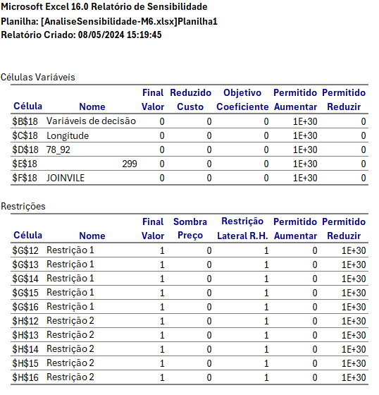

# Entendimento do contexto do problema: Modelagem e Representação

## Sumário

[1. Expressões Matemáticas](#c1)
<br>
[2. Análise de Sensibilidade](#c2)
<br>
[3. Complexidade e Corretude do Algoritmo](#c3)

## <a name="c1"></a> 1. Expressões Matemáticas
 
<div align="justify">

### A) Qual o contexto do problema a ser resolvido?

&emsp; O contexto do problema envolve a otimização de rotas de leitura dos hidrômetros dos clientes da Aegea, uma empresa de saneamento básico brasileira. A leitura dos hidrômetros é realizada mensalmente e é fundamental para o registro do consumo mensal de água dos clientes. Em alguns casos, a conta é impressa na hora. As rotas de leitura são definidas por conjuntos de ligações que devem ser visitadas pelos leituristas diariamente, sendo realizadas a pé ou com o meio de transporte mais indicado para o deslocamento entre localidades.

É importante considerar fatores como a jornada de trabalho dos leituristas, os dias úteis do mês e o perigo da travessia de ruas e avenidas ao planejar essas rotas. Com mais de 1,6 milhões de ligações lidas mensalmente apenas em Águas do Rio, no estado do Rio de Janeiro, e quase 400 leituristas responsáveis pela execução de mais de 4.000 rotas, a otimização dessas rotas é essencial para melhorar a produtividade da leitura e entrega das contas, impactando diretamente no faturamento da empresa.

**B) Quais os dados disponíveis?**

&emsp; Os dados disponibilizados para o desenvolvimento do projeto incluem uma tabela com pontos de clientes e um arquivo com as bases de onde os leituristas saem. A tabela de pontos dos clientes oferece as informações necessárias para o agrupamento e sequenciamneto das ligações de cada rota, elementos cruciais para atingir a "solução ótima" do projeto.

A tabela abaixo detalha exatamente quais os dados disponibilizados a este projeto pela Aegea:

Tabela 1.B.1. Colunas dos Dados da Instalação

| Nome | Tipo | Descrição |
| ---- | ---- | --------- |
| Índice | Numérico | Identificador da instalação |
| Latitude | Numérico | Latitude da instalação |
| Longitude | Numérico | Longitude da instalação |
| Logradouro | Texto | Logradouro da instalação |
| Número | Numérico | Número do endereço da instalação |
| Código da Rota | Numérico | Código utilizado para identificar a rota atual de cada instalação |
| Sequência | Numérico | Ordem na qual a instalação é visitada |

Ao fazer uma análise preliminiar dos dados da Aegea, pode-se perceber o nível de qualidade da base de dados: não há se quer um ponto de dado faltante (dentro das instalações fornecidas) com excessão dos números da instalação que, pela forma que os endereços funcionam na vida real, podem de fato ser nulos. Vale notar que a base de dados tem tamanho considerável, com 378.299 registros/instalações.

### C) Qual o objetivo do problema?

&emsp;O objetivo deste projeto é desenvolver um algoritmo capaz de otimizar a eficiência da geração de rotas para leitura de hidrômetros. Buscamos maximizar o número de leituras feitas em cada rota, levando em conta restrições como o tempo disponível para leitura, a velocidade de deslocamento dos leituristas e o tempo de leitura em si.

&emsp;Quando falamos sobre o tempo médio, estamos nos referindo ao tempo médio total gasto em cada rota, que inclui tanto o tempo de leitura do hidrômetro quanto o tempo de deslocamento entre as leituras. Portanto, a somatória dos tempos de leitura é uma parte importante dessa média, mas também consideramos o tempo de percurso, já que o tempo gasto na leitura do medidor é considerado constante.

&emsp;O foco principal é reduzir a quantidade de rotas e o tempo total de conclusão de cada rota, garantindo que todas as ligações sejam visitadas dentro do período de leitura estabelecido. Espera-se alcançar benefícios significativos, como aumento da taxa de entrega de contas, bem como uma melhoria geral na efetividade da leitura, contribuindo assim para o bom funcionamento dos processos de faturamento e entrega de serviços da Aegea.


### D) Identifique pelo menos dois recursos que representam limitações neste problema?

&emsp;Este problema é limitado por restrições operacionais e recursos finitos:
- A primeira restrição é determinada pela carga horária dos leituristas, que estabelece um limite máximo de horas de trabalho diário.
- A segunda restrição envolve a quantidade de leituristas atuando simultaneamente e a velocidade de deslocamento de cada um, que é fixada em 5 km/h.
- A terceira restrição refere-se ao ponto inicial da rota de cada leiturista. As rotas devem ser planejadas considerando o ponto de partida de cada leiturista no início de seu expediente, garantindo a eficiência dos trajetos.

&emsp;Essas restrições têm uma relação direta com a capacidade de cada leiturista em realizar leituras diárias, determinando o número máximo de hidrômetros que podem ser lidos por cada funcionário em um único dia.

</div>

### E) Quais são as expressões matemáticas que representam a função objetivo e as restrições/limitações do problema?
O problema descrito anteriormente pode ser representado de acordo com algumas funções matemáticas; mas, antes de se determinar a função objetivo, é necessário especificar (matemáticanente) os parâmetros do problema e suas restrições.

#### 1) Parâmetros (Variáveis) e Restrições de Domínio
Como descrito pela Aegea, a solução deve levar em consideração as seguintes variáveis:

| Símbolo | Dimensão/Unidade | Descrição | Restrições de Domínio |
| ------- | ------- | --------- | --------------------- |
| $D$ | Dia | Dias de Leitura no mês | $D: D \in \mathbb{Q}^*, D \leq 22$|
| $H$ | $\frac{hora}{leiturista \cdot dia}$ | Horas de Trabalho diárias por leiturista | $H: H \in \mathbb{Q}^*, H \leq 6$ |
| $I$ | Instalação | Quantidade de Instalações | $I:  I \in \mathbb{Z}^*$ |
| $S_{j, k}$ | km | Distância entre a instalação $j$ e $k$ | $L: L \in \mathbb{Q}^*$ |
| $T$ | $\frac{hora}{instalação}$ | Tempo Médio de Leitura por Instalação | $T \in \mathbb{Q}^*, T = 2$|
| $V$ | $\frac{km}{h}$ | Velocidade do Leiturista | $V: V \in \mathbb{Q}^*, V \leq 5$|

Além das partes descritas acima, deve-se levar em consideração a restrição que cada ponto $p$ pode ser destino de apenas uma rota $X_{i,p}$ e origem de apenas uma rota $X_{p,j}$; ou seja: cada instalação pode ser visitada uma, e somente uma, vez.

#### 2) Variáveis de Decisão
Pela natureza do problema, todas as instalações precisam ser visitas uma, e apenas uma, vez. Na função objetivo, as variáveis de decisão são representadas no formato $x_{i,j}$ representando uma rota onde o leiturista sai da instalação $i$ para $j$. O valor destas variáveis são binários: 0 significa que nenhum leiturista percorrerá esta rota; em contrapartida, 1 significa que alguém percorrerá a rota.

Vale ressaltar que o objetivo deste modelo é reduzir a rota total percorrida pelos leituristas. A divisão das rotas entre os $L$ leituristas é um problema que será mitigado posteriormente, por uma solução complementar.

#### 3) Função Objetivo
O objetivo de toda empresa é reduzir custo sem comprometer a qualidade da entrega. No caso da Aegea, isso se traduz em minimizar a quantidade de leituristas levando em conta as restrições do problema.

Tendo em mente o que foi descrito na seção 1.E.2 e os parâmetros da seção 1.E.1, a função objetiva é dada por:

> (Expressão 1.E.3.1) Minimizar: $\frac{I \cdot T + \frac{\sum_{j=1}^{I}\sum_{k=1}^{I}S_{j,k}X_{j,k}}{V}}{H \cdot D}$ 

Sabendo que os parâmetros da função são constantes após o início da execução do algoritmo que será desenvolvindo, pode-se simplificar a função objetivo para:
> (Expressão 1.E.3.2) Minimizar: $\sum_{j=1}^{I}\sum_{k=1}^{I}S_{j,k}X_{j,k}$

#### 4) Análise Dimensional da Função Objetivo
Para ter certeza que a resposta da função objetivo responde a pergunta proposta, faz-se necessária uma análise dimensional:
> (Expressão 1.E.4.1) $\frac{[instalação]\frac{[hora]}{[instalação]} + \frac{[km]}{\frac{[km]}{[hora]}}}{\frac{[hora]}{[leiturista] \cdot [dia]} \cdot [dia]} = \frac{[hora] + [hora]}{\frac{[hora]}{[leiturista]}} = \frac{1}{\frac{1}{[leiturista]}} = [leiturista]$

Ou seja, a expressão 1.E.3.1 tem unidade "Leiturista", cumprindo com o proposto na seção 1.E.3. 

É importante nota que, para que os resultados da expressão simplificada (1.E.3.2) respondam à pergunta proposta, é necessário transformá-la para o formato da expressão 1.E.3.2 novamente.

Chamando o resultado da expressão 1.E.3.2 de $G$, esta transformação é dada por:
> (Expressão 1.E.4.2) $\frac{I \cdot T + \frac{G}{V}}{H \cdot D}$ com dimensão [Leiturista]

## <a name="c2"></a> 2. Análise de Sensibilidade

&emsp;A análise de sensibilidade na programação linear é uma ferramenta essencial para entender como as mudanças nos parâmetros de um modelo podem afetar a solução ótima de uma determinada função objetivo. Essa análise pode indicar o quão "sensíveis" são os resultados às variações nas variáveis do modelo, ajudando na tomada de decisão e no planejamento estratégico em um cenário corporativo.

&emsp;O problema descrito anteriormente, focado na otimização de rotas para a leitura de hidrômetros, pode ser enquadrado como um problema de programação linear inteira. Isso ocorre porque as variáveis de decisão no problema (as rotas entre as instalações) são binárias (0 ou 1), caracterizando um problema de decisão discreta. Um problema análago ao encontrado no projeto é o Problema do Caixeiro Viajante, onde o objetivo consiste em realizar um ciclo hamiltoniano dentro de um grafo completo com a menor distância possível, ou seja, o menor peso somado das arestas dentro do caminho (no caso do problema da Aegea, cada hidrômetro é considerado como um nó do grafo). Este tipo de problema possui uma complexidade muito maior do que problemas que aceitam respostas fracionárias, sendo chamados de NP-Completo, ou seja, uma classe de problemas que não possuem uma solução em tempo polinomial.

&emsp;No contexto de problemas de programação linear inteira, a coluna de "custo reduzido" dos resultados da análise de sensibilidade é a coluna de maior importância para compreender a sensibilidade das variáveis do modelo. O custo reduzido indica o quanto o custo da função objetivo seria reduzido se uma variável não-básica (com valor zero na solução ótima) fosse introduzida na base com um valor positivo. Um custo reduzido positivo sugere que incluir essa variável não-básica na solução aumentaria o custo total, portanto, não é desejável nesse caso. Um custo reduzido negativo, por outro lado, indica que há potencial para reduzir o custo total ao ajustar a rota para incluir essa variável.

&emsp;Abaixo, a imagem representa a análise de realizada utilizando 5 pontos de leitura:

<p align="center"> Imagem 1 - Análise de sensibilidade</p>
<p align="center">
  
</p>

&emsp;Ao observar o custo reduzido de cada célula variável, é possível notar que o valor de todas é igual à 0, indicando que as arestas presentes na solução fazem parte da solução ótima. Vale ressaltar que esse método é viável em problemas como o do Caixeiro Viajante somente em instâncias muito pequenas do problema, tendo em vista que a complexidade para executar tal método cresce de maneira exponencial, tornando-o inviável computacionalmente.


## <a name="c3"></a> 3. Complexidade e Corretude do Algoritmo

### Análise da Complexidade

&emsp;Para realizar a análise de complexidade e corretude do algoritmo de roteirização, é necessário separá-lo em 3 etapas principais: a estimativa do número de leituristas necessários com base nos parâmetros passados ao modelo, a clusterização, que determina o número de leituristas e seu respectivo conjunto de casas a serem visitadas no mês, e o roteamento de cada um dos clusters, ou seja, a criação da rota mensal de cada um dos leituristas.

#### Estimativa do Número de Leituristas

&emsp;Para determinar o número ideal de leituristas dada a região, é realizada uma estimativa baseada nos parâmetros da modelagem matemática (dias de trabalho mensais, horas de trabalho diárias, velocidade de leitura, velocidade de locomoção). Para obter uma estimativa da distância média entre 2 pontos dentro do dataset fornecido, é utilizado o algoritmo Nearest Neighbors Search para calcular as distâncias dos pontos vizinhos mais próximos para cada ponto dos dados fornecidos. Dessa forma, é feita uma média dessas distâncias, resultando em uma estimativa útil e suficientemente precisa para os cálculos subsequentes.

$n:$ Número de pontos no dataset
<br>
$k:$ Número de vizinhos mais próximos
<br>

$\text{Coordenadas } X = \{x_1, x_2, x_3, ... x_n\}$
<br>
$\text{Distâncias entre Coordenadas } i \text{ e } j\,D = \{d_{i1}, d_{i2}, d_{i3}, ... d_{ij}\}$
<br>

$$
 \text{Distância média entre 2 pontos } \overline{d} = \frac{1}{n \cdot (k-1)} \sum_{i=1}^n \sum_{j=2}^k d_{ij}
$$

&emsp;Após encontrar a distância média entre 2 pontos, estima-se o tempo médio para ir de um ponto até outro, que se baseia na distância média entre 2 pontos dividido pela velocidade. Ao somar o tempo de leitura ao tempo médio de leitura, é possível estimar o tempo gasto para realizar a leitura e se locomover para o próximo ponto.


$$
\begin{align*}
t_{\text{locom}} &= \frac{\overline{d}}{v_{\text{locom}}} \\
t_{\text{total}} &= t_{\text{leitura}} + t_{\text{locom}} \\
\end{align*}
$$

&emsp;Logo, o número máximo factível de pontos visitados por mês é equivalente às horas mensais de trabalho dividido pelo tempo médio total gasto em cada ponto. Por fim, ao estimar a distância total do dataset multiplicando a distância média entre 2 pontos com o número total de pontos, é possível determinar o número ideal de leituristas ao dividir a distância total pela distância máxima factível

$$
\begin{align*}
P_{\text{max}} &= \frac{H_{\text{mensal}}}{t_{\text{total}}} \\
D_{\text{max}} &= \overline{d} \cdot (P_{\text{max}} - 1) \\
L_{\text{ideal}} &= \lceil \frac{n \cdot \overline{d}}{D_{\text{max}}} \rceil \\
\end{align*}
$$

&emsp;A complexidade do algoritmo é determinada principalmente pelo algoritmo Nearest Neighbors Search, já que todo o restante das operações são executadas em tempo constante $O(1)$. A versão do Nearest Neighbors Search utilizada é a k-d Tree, uma técnica eficiente para encontrar pontos próximos em grandes conjuntos de dados multidimensionais. A k-d Tree organiza os dados em uma árvore binária, partindo-os alternadamente em cada dimensão pelo valor mediano. Durante a busca, a árvore é percorrida a partir da raiz até um nó folha seguindo o caminho que levaria ao ponto de consulta. O processo então realiza um backtracking, revisando caminhos alternativos na árvore para garantir que os pontos mais próximos não sejam perdidos, mesmo que estejam em um lado diferente de uma divisão anterior. Segue abaixo a complexidade da versão k-d Tree Search do algoritmo Nearest Neighbors Search:


> (Expressão 3.1) Complexidade Nearest Neighbors Search: $O(n \cdot \log(n))$

&emsp;O melhor caso do algoritmo tem complexidade $\Theta(\log(n))$, em um cenário onde os pontos já estejam ordenados na hora da montagem da árvore binária.

#### K-Means

&emsp;A versão do algoritmo K-Means utilizado no projeto é a de Lloyd, uma das versões mais clássicas e utilizadas no mundo. O programa funciona em 3 etapas: na etapa 1, é feita a inicialização dos clusters, em que dado um número $k$ de clusters, os centróides de cada grupo são posicionados de maneira aleatória no espaço. Em seguida, na etapa 2, cada ponto torna-se membro do cluster com seu centróide mais próximo. Na etapa 3, os centróides são recalculados baseado na menor distância média de todos os pontos do cluster. As etapas 2 e 3 são repetidas até o ponto em que não ocorra mais nenhuma mudança na clusterização. Dessa forma, segue abaixo a expressão que representa a complexidade do algoritmo K-Means de Lloyd descrito acima:

$n:$ Número de pontos a serem clusterizados
<br>
$k:$ Número de clusters
<br>
$d:$ Número de dimensões (na aplicação do projeto, são levadas em consideração 2 dimensões)
<br>
$i:$ Número de iterações necessárias até a convergência (sem mudanças nos clusters)

> (Expressão 3.2) Complexidade K-Means de Lloyd: $O(n\cdot k \cdot d \cdot i)$

&emsp;No pior caso, o algoritmo K-Means de Lloyd executa em complexidade não polinomial, já que não existe uma garantia para o número de iterações necessárias para o algortimo executar. Porém, na prática, sua complexidade é praticamente "linear", já que na maioria dos casos, poucas dezenas de iterações são necessárias para alcançar uma clusterização que quase alcança a convergência, tendo pouca ou nenhuma melhoria em iterações subsequentes.

#### Greedy Travelling Salesman Problem (TSP)

&emsp;Tendo todos os cluster separados, o algoritmo utilizado para gerar as menores rotas em cada um deles utiliza a estratégia gulosa (greedy), que parte do princípio de que a melhor escolha local é a melhor escolha global. Dessa forma, partindo de um ponto aleatório, o próximo ponto da rota será o com a menor distância do ponto atual, sendo selecionados os pontos que ainda não foram visitados. Esse tipo de algoritmo não traz a solução ótima, já que a melhor escolha local não reflete na melhor escolha global. Porém, apesar de ser considerado impreciso, sua execução provou-se muito mais rápida do que os outros algoritmos testados, resultando em soluções satisfatórias. A complexidade do algoritmo sendo rodado para cada cluster pode ser representada da seguinte forma:

$k:$ Número de clusters
<br>
$n:$ Número de pontos
<br>
$m:$ Número de pontos nos clusters (considerando uma distribuição uniforme dos pontos para cada cluster)
<br>

$$
\begin{align*}
m &= \frac{n}{k} \\
\text{Complexidade} &= m^2 \cdot k \\
\text{Complexidade} &= (\frac{n}{k})^2 \cdot k \\
\text{Complexidade} &= \frac{n^2}{k} \\
\end{align*}
$$

> (Expressão 3.3) Complexidade Greedy TSP: $O(\frac{n^2}{k})$

&emsp;Tanto no melhor quanto no pior caso, o algoritmo guloso tem a mesma complexidade, o que traz ainda mais vantagens para a sua aplicação prática.

### Análise da Corretude

&emsp;A análise de corretude de uma algoritmo é fundamental para provar de maneira formal que, dada uma entrada válida, o algoritmo sempre devolverá uma resposta correta baseada no propósito do algoritmo. O algoritmo que será analisado será o guloso para o problema do TSP, sendo esse o algoritmo essencial para realizar o roteamento, que é o propósito principal da aplicação. 

&emsp;Segue abaixo em pseudocódigo o seu funcionamento:


```plaintext
def greedy(pontos, ponto_inicial)
    1. SE pontos é vazio
       - RETORNE [], 0

    2. num_pontos = tamanho de pontos
    3. visitado = lista de tamanho num_pontos, todos como falso
    4. caminho = lista vazia
    5. distancia_total = 0

    6. ponto_atual = ponto_inicial
    7. visitado[ponto_atual] = verdadeiro
    8. caminho.append(ponto_atual)

    9. i = 1
    10. ENQUANTO i < num_pontos
        - proximo_ponto = -1
        - menor_distancia = infinito

        11. PARA j DE 0 ATÉ num_pontos - 1
            - SE não visitado[j] E distância(ponto_atual, j) < menor_distancia
                - menor_distancia = distância(ponto_atual,j)
                - proximo_ponto = j

        12. SE proximo_ponto == -1
            - INTERROMPA

        13. visitado[proximo_ponto] = verdadeiro
        14. caminho.append(proximo_ponto)
        15. distancia_total = distancia_total + menor_distancia
        16. ponto_atual = proximo_ponto

        17. i = i + 1

    18. RETORNE caminho, distancia_total
```

&emsp;Dentro do campo da análise de corretude, a indução no invariante do laço é um método essencial em algoritmos que utilizam loops, ou seja, estruturas iterativas onde as variáveis trocam de valor. O invariante do laço garante que uma condição se manterá verdadeira para cada iteração, independente do número total de iterações ou da entrada (a entrada ainda deve ser válida para existir o invariante).

&emsp;No caso da abordagem gulosa no TSP, o invariante do laço pode ser definido no loop `while`, onde em cada iteração a lista `caminho` possuí um subcaminho válido que começa na `ponto_inicial`, passa por todos os pontos marcados como `verdadeiro` na lista `visitado` uma única vez e termina no `ponto_atual`. Esse subcaminho possuí o menor caminho possível de ser obtido começando no ponto inicial fornecido e seguindo a estratégia gulosa de escolher a cidade mais próxima não visitada. É importante ressaltar que o subcaminho não é uma solução ótima global, e sim uma solução ótima local, pois a estratégia gulosa leva apenas em consideração variáveis de escolha locais.

&emsp;Na inicialização do algoritmo, antes da primeira iteração do loop `while`, a variável `caminho` contém apenas a cidade inicial, sendo um subcaminho trivial, tendo em vista que não existe uma distância entre duas cidades.

&emsp;Já na iteração `i`, assume-se que o invariante é verdadeiro para a iteração `i - 1`. Dessa forma, o ponto `i` adicionado ao `caminho` segue as regras de ser o ponto mais próximo do último ponto em `caminho` não visitado.

&emsp;Tendo todas as cidades marcadas como visitadas, o caminho está completo (no caso aplicado ao projeto, não é necessário retornar ao ponto inicial), respeitando o invariante do laço e comprovando a corretude do algoritmo guloso.

&emsp; Dessa forma, a análise da corretude utilizando a indução do invariante do laço demonstra a capacidade da estratégia gulosa do problema TSP de devolver uma solução ótima local para cada passo de sua execução. Essa garantia é essencial para a validade da utilização do algoritmo em cenários onde extração de uma solução ótima global é inviável, como é no caso do projeto. Portanto, mesmo não sendo um algoritmo determinístico, o algoritmo guloso é uma ferramenta valiosa para aproximar soluções, dado sua simplicidade, velocidade e eficácia.
