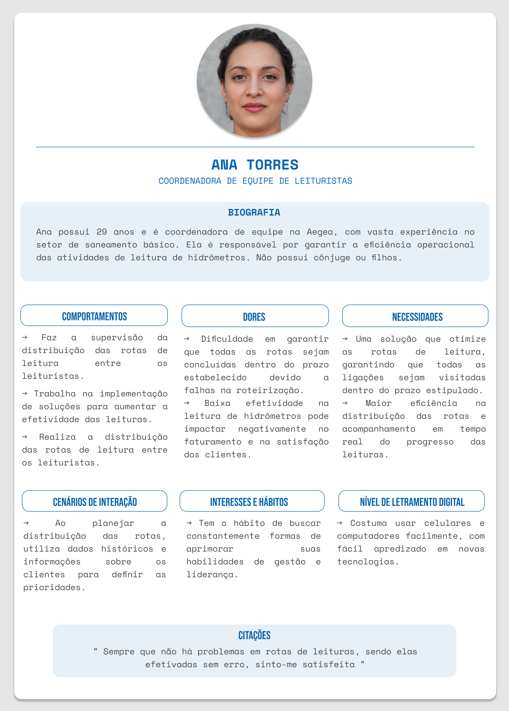

# Entendimento da experiência do usuário

## Sumário

[1. Personas](#c1)
[2. User Stories](#c2)
[3. Jornada do usuário](#c3)

##  1. Personas 

&emsp;As personas são representações fictícias, porém fundamentadas em comportamentos reais, de arquétipos de usuários que podem interagir com um produto. Elas são construídas com base em informações demográficas, comportamentais, necessidades e objetivos típicos do público-alvo. Por meio das personas, os projetistas conseguem compreender melhor as necessidades, desejos e motivações dos usuários finais, o que possibilita o desenvolvimento de soluções mais eficazes.

&emsp;Cada persona é elaborada de forma a retratar características específicas de indivíduos reais, representando grupos distintos de usuários que podem utilizar o produto ou serviço em questão. Essas características incluem informações como idade, gênero, profissão, interesses, hábitos de consumo, desafios enfrentados e objetivos a serem alcançados.

&emsp;No contexto da empresa Aegea, foram delineadas duas personas principais: a coordenadora de equipes de leituristas, responsável pela gestão do fluxo de trabalho, e o leiturista, o profissional responsável pela coleta de dados.

 Figura 1 - Persona 01 

  

 Elaboração AeGeo 

&emsp;A persona do Leiturista, representada por Marcos Silva, destaca a importância de compreender os desafios enfrentados pelos leituristas de hidrômetros. Através da análise de suas tarefas diárias, como a necessidade de caminhar entre os endereços dos clientes e a preocupação com a segurança durante o percurso, foi possível identificar a relevância de uma solução que otimize as rotas de leitura. Além disso, as dores expressas por Marcos, como as dificuldades em encontrar endereços e a falta de eficiência no sistema de roteirização, forneceram insights cruciais para o desenvolvimento de uma ferramenta que não apenas aumente a produtividade dos leituristas, mas também promova sua segurança e bem-estar no ambiente de trabalho.

 Figura 1 - Persona 02 

  

 Elaboração AeGeo 

&emsp;Por outro lado, a persona do Gestor de Leituristas, representada por Ana Torres, ressalta a importância de entender as expectativas dos líderes responsáveis pela coordenação das equipes de leitura. Através da análise das dores enfrentadas por Ana, como a dificuldade em garantir o cumprimento dos prazos de leitura e a falta de ferramentas eficientes para monitorar o desempenho da equipe, foram obtidos insights valiosos para o desenvolvimento de uma solução que melhore a eficiência operacional e a gestão do trabalho dos leituristas. Dessa forma, a criação de uma ferramenta que atenda às necessidades tanto dos colaboradores de campo quanto dos gestores, contribui para o aprimoramento dos processos de leitura de hidrômetros e para o sucesso operacional da Aegea Saneamento.

##  2. User Stories 

&emsp;As User Stories são um componente essencial do processo de ideação da solução de um problema, servindo como uma ponte entre os requisitos técnicos e as necessidades humanas. Elas são fundamentais para garantir que o software desenvolvido esteja em sintonia com as expectativas e exigências dos usuários finais. Essas histórias são formuladas a partir da perspectiva dos usuários, neste caso, Marcos Silva, leiturista de hidrômetros, e Ana Torres, coordenadora da equipe de leituristas. Cada história é projetada para abordar desafios específicos que esses profissionais enfrentam em seu trabalho diário, refletindo suas necessidades de maneira precisa e prática.

&emsp;Marcos e Ana representam papéis complementares dentro da mesma equipe, onde Marcos está diretamente envolvido com as atividades de campo e Ana gerencia e coordena essas atividades, garantindo a eficácia operacional e a satisfação da equipe. As User Stories detalhadas nesta seção foram  desenvolvidas para abordar desde a otimização de rotas em áreas urbanas, exigida por Marcos para melhorar sua eficiência diária, até a necessidade de Ana em gerenciar e evitar sobreposições de trabalho e garantir uma distribuição eficaz das tarefas. Ao focar nas experiências e desafios de ambos, podemos projetar um sistema que não só atenda às suas expectativas, mas também contribua significativamente para a melhoria da qualidade e eficiência do trabalho em toda a equipe de leituristas.

&emsp;&emsp;Segue abaixo as User Stories representadas em forma de tabela:

<table class="tg">
<thead>
   <tr>
    <th style="border: 1px solid white; padding: 10px;">Número</th>
    <th style="border: 1px solid white; padding: 10px;" colspan="4">T001</th>
  </tr>
<tbody>
  <tr>
    <td style="border: 1px solid white; padding: 10px;">Título</td>
    <td style="border: 1px solid white; padding: 10px;" colspan="4">Otimização de Rotas em Áreas Urbanas</td>
  </tr>
  <tr>
    <td class="tg-0pky" style="border: 1px solid white; padding: 10px;">Persona</td>
    <td class="tg-0pky" style="border: 1px solid white; padding: 10px;" colspan="4">Marcos Silva, leiturista</td>
  </tr>
  <tr>
    <td class="tg-0pky" style="border: 1px solid white; padding: 10px;">História</td>
    <td class="tg-0pky" style="border: 1px solid white; padding: 10px;" colspan="4">Eu, como leiturista, desejo um sistema que automaticamente sugira as melhores rotas para leitura em áreas urbanas densas, para reduzir o tempo gasto em trânsito e aumentar a eficiência das minhas leituras diárias.</td>
  </tr>
  <tr>
    <td class="tg-0pky" style="border: 1px solid white; padding: 10px;">Critérios de  Aceitação</td>
    <td class="tg-0pky" style="border: 1px solid white; padding: 10px;">O sistema deve identificar e sugerir a rota mais rápida entre múltiplos pontos de leitura.</td>
    <td class="tg-0pky" style="border: 1px solid white; padding: 10px;">O sistema deve permitir que o usuário ajuste a rota manualmente se necessário.</td>
    <td class="tg-0pky" style="border: 1px solid white; padding: 10px;">O sistema deve computar rotas que são possíveis de serem percorridas dentro do período do expediente, evitando horas extras.</td>
  </tr>
  <tr>
    <td class="tg-0pky" style="border: 1px solid white; padding: 10px;">Testes de  Aceitação</td>
    <td class="tg-0pky" style="border: 1px solid white; padding: 10px;">Verificar se o sistema sugere rotas considerando o menor tempo de percurso.</td>
    <td class="tg-0pky" style="border: 1px solid white; padding: 10px;">Verificar se as rotas são facilmente alteráveis.</td>
    <td class="tg-0pky" style="border: 1px solid white; padding: 10px;">Verificar a quantidade de horas extras realizadas por cada leiturista.</td>
  </tr>
</tbody>
</table>

<table class="tg">
<thead>
  <tr>
    <th class="tg-0pky" style="border: 1px solid white; padding: 10px;">Número</th>
    <th class="tg-0pky" style="border: 1px solid white; padding: 10px;" colspan="4">T002</th>
  </tr>
<tbody>
  <tr>
    <td class="tg-0pky" style="border: 1px solid white; padding: 10px;">Título</td>
    <td class="tg-0pky" style="border: 1px solid white; padding: 10px;" colspan="4">Prevenção de Leituras em Locais Repetidos</td>
  </tr>
  <tr>
    <td class="tg-0pky" style="border: 1px solid white; padding: 10px;">Persona</td>
    <td class="tg-0pky" style="border: 1px solid white; padding: 10px;" colspan="4">Marcos Silva, leiturista</td>
  </tr>
  <tr>
    <td class="tg-0pky" style="border: 1px solid white; padding: 10px;">História</td>
    <td class="tg-0pky" style="border: 1px solid white; padding: 10px;" colspan="4">Eu, como leiturista, quero que o sistema evite rotas que incluem pontos onde a leitura já foi realizada no mesmo dia, para maximizar a cobertura da área e otimizar meu tempo.</td>
  </tr>
  <tr>
    <td class="tg-0pky" style="border: 1px solid white; padding: 10px;">Critérios de  Aceitação</td>
    <td class="tg-0pky" style="border: 1px solid white; padding: 10px;">O sistema deve reconhecer regiões já percorridas no mesmo dia e evitá-las nas sugestões de rota subsequentes.</td>
    <td class="tg-0pky" style="border: 1px solid white; padding: 10px;">O sistema deve permitir a revisão das rotas propostas antes de serem finalizadas para o dia.</td>
    <td class="tg-0pky" style="border: 1px solid white; padding: 10px;">Carlos deve poder visualizar um resumo das áreas já cobertas no dia.</td>
  </tr>
  <tr>
    <td class="tg-0pky" style="border: 1px solid white; padding: 10px;">Testes de  Aceitação</td>
    <td class="tg-0pky" style="border: 1px solid white; padding: 10px;">Verificar se o sistema exclui regiões já percorridas das novas rotas propostas.</td>
    <td class="tg-0pky" style="border: 1px solid white; padding: 10px;">Testar a funcionalidade de revisão das rotas antes da finalização.</td>
    <td class="tg-0pky" style="border: 1px solid white; padding: 10px;">Avaliar a precisão do resumo de cobertura de área diária.</td>
  </tr>
</tbody>
</table>

<table class="tg">
<thead>
  <tr>
    <th class="tg-0pky" style="border: 1px solid white;">Número</th>
    <th class="tg-0pky" style="border: 1px solid white;" colspan="4">T003</th>
  </tr>
<tbody>
  <tr>
    <td class="tg-0pky" style="border: 1px solid white;">Título</td>
    <td class="tg-0pky" style="border: 1px solid white;" colspan="4">Otimização de Rotas para o Período Matutino</td>
  </tr>
  <tr>
    <td class="tg-0pky" style="border: 1px solid white;">Persona</td>
    <td class="tg-0pky" style="border: 1px solid white;" colspan="4">Marcos Silva, leiturista</td>
  </tr>
  <tr>
    <td class="tg-0pky" style="border: 1px solid white;">História</td>
    <td class="tg-0pky" style="border: 1px solid white;" colspan="4">Eu, como leiturista, desejo que o sistema otimize minhas rotas de leitura para serem concentradas no período da manhã, momento em que me sinto mais produtivo e energizado para realizar meu trabalho de forma eficiente.</td>
  </tr>
  <tr>
    <td class="tg-0pky" style="border: 1px solid white;">Critérios de  Aceitação</td>
    <td class="tg-0pky" style="border: 1px solid white;">O sistema deve priorizar a programação de rotas de leitura entre as 7h e as 12h.</td>
    <td class="tg-0pky" style="border: 1px solid white;">O sistema deve fornecer uma estimativa do tempo necessário para completar as rotas matutinas.</td>
    <td class="tg-0pky" style="border: 1px solid white;">O sistema deve alertar Carlos sobre a proximidade do fim do período matutino, possibilitando a conclusão das tarefas dentro do tempo planejado.</td>
  </tr>
  <tr>
    <td class="tg-0pky" style="border: 1px solid white;">Testes de  Aceitação</td>
    <td class="tg-0pky" style="border: 1px solid white;">Verificar se o sistema efetivamente agenda todas as rotas possíveis para o período da manhã.</td>
    <td class="tg-0pky" style="border: 1px solid white;">Avaliar a precisão das estimativas de tempo de conclusão fornecidas pelo sistema.</td>
    <td class="tg-0pky" style="border: 1px solid white;">Testar o sistema de alertas que notifica Carlos sobre o término do período matutino.</td>
  </tr>
</tbody>
</table>

&emsp;Abaixo segue as user stories da Ana Torres:

<table class="tg">
<thead>
  <tr>
    <th class="tg-0pky" style="border: 1px solid white;">Número</th>
    <th class="tg-0pky" style="border: 1px solid white;" colspan="4">T001</th>
  </tr>
<tbody>
  <tr>
    <td class="tg-0pky" style="border: 1px solid white;">Título</td>
    <td class="tg-0pky" style="border: 1px solid white;" colspan="4">Otimização de Rotas para Leituristas da Aegea.</td>
  </tr>
  <tr>
    <td class="tg-0pky" style="border: 1px solid white;">Persona</td>
    <td class="tg-0pky" style="border: 1px solid white;" colspan="4">Ana Torres, Coordenadora de equipe de leituristas na Aegea.</td>
  </tr>
  <tr>
    <td class="tg-0pky" style="border: 1px solid white;">História</td>
    <td class="tg-0pky" style="border: 1px solid white;" colspan="4">Eu, como coordenadora, quero otimizar as rotas de leitura de hidrômetros para garantir que todas as ligações sejam visitadas dentro do prazo estipulado e aumentar a eficiência operacional da equipe de leituristas.</td>
  </tr>
  <tr>
    <td class="tg-0pky" style="border: 1px solid white;">Critérios de  Aceitação</td>
    <td class="tg-0pky" style="border: 1px solid white;">O sistema deve permitir a inserção das variáveis de entrada (dias de leitura, horas de trabalho, velocidade do leiturista, tempo de leitura, quantidade de leituristas).</td>
    <td class="tg-0pky" style="border: 1px solid white;">O sistema deve gerar rotas otimizadas minimizando a distância total percorrida e o número de travessias de rua, considerando o tempo máximo de percurso de cada leiturista.</td>
    <td class="tg-0pky" style="border: 1px solid white;">O sistema deve maximizar o número de ligações lidas por rota.</td>
  </tr>
  <tr>
    <td class="tg-0pky" style="border: 1px solid white;">Testes de  Aceitação</td>
    <td class="tg-0pky" style="border: 1px solid white;">Verificar se todas as variáveis de entrada podem ser ajustadas e são consideradas no algoritmo de otimização.</td>
    <td class="tg-0pky" style="border: 1px solid white;">Avaliar se as rotas otimizadas realmente minimizam a distância e as travessias de rua.</td>
    <td class="tg-0pky" style="border: 1px solid white;">Conferir se o número de ligações por rota aumentou após a otimização.</td>
  </tr>
</tbody>
</table>

<table class="tg">
<thead>
  <tr>
    <th class="tg-0pky" style="border: 1px solid white;">Número</th>
    <th class="tg-0pky" style="border: 1px solid white;" colspan="4">T002</th>
  </tr>
<tbody>
  <tr>
    <td class="tg-0pky" style="border: 1px solid white;">Título</td>
    <td class="tg-0pky" style="border: 1px solid white;" colspan="4">Implementação de uma ferramenta de gerenciamento de equipes de leituristas</td>
  </tr>
  <tr>
    <td class="tg-0pky" style="border: 1px solid white;">Persona</td>
    <td class="tg-0pky" style="border: 1px solid white;" colspan="4">Ana Torres, Coordenadora de equipe de leituristas na Aegea</td>
  </tr>
  <tr>
    <td class="tg-0pky" style="border: 1px solid white;">História</td>
    <td class="tg-0pky" style="border: 1px solid white;" colspan="4">Eu, como coordenadora, quero implementar uma ferramenta de gerenciamento de equipe que me permita supervisionar e distribuir as rotas de leitura de hidrômetros entre os leituristas de forma eficiente e equilibrada.</td>
  </tr>
  <tr>
    <td class="tg-0pky" style="border: 1px solid white;">Critérios de  Aceitação</td>
    <td class="tg-0pky" style="border: 1px solid white;">A ferramenta deve permitir a visualização do condição atual e a localização de todos os leituristas.</td>
    <td class="tg-0pky" style="border: 1px solid white;">A ferramenta deve permitir a comunicação direta com os leituristas para orientações e atualizações em tempo real.</td>
  </tr>
  <tr>
    <td class="tg-0pky" style="border: 1px solid white;">Testes de  Aceitação</td>
    <td class="tg-0pky" style="border: 1px solid white;">Confirmar se a localização e a condição dos leituristas são atualizados em tempo real e são precisos.</td>
    <td class="tg-0pky" style="border: 1px solid white;">Testar a funcionalidade de comunicação e verificar a facilidade de uso e a rapidez na troca de mensagens.</td>
  </tr>
</tbody>
</table>

<table class="tg">
<thead>
  <tr>
    <th class="tg-0pky" style="border: 1px solid white;">Número</th>
    <th class="tg-0pky" style="border: 1px solid white;" colspan="4">T003</th>
  </tr>
<tbody>
  <tr>
    <td class="tg-0pky" style="border: 1px solid white;">Título</td>
    <td class="tg-0pky" style="border: 1px solid white;" colspan="4">Ferramenta de relatórios para análise operacional das atividades de leitura</td>
  </tr>
  <tr>
    <td class="tg-0pky" style="border: 1px solid white;">Persona</td>
    <td class="tg-0pky" style="border: 1px solid white;" colspan="4">Ana Torres, Coordenadora de equipe de leituristas na Aegea</td>
  </tr>
  <tr>
    <td class="tg-0pky" style="border: 1px solid white;">História</td>
    <td class="tg-0pky" style="border: 1px solid white;" colspan="4">Eu, como Ana, quero uma ferramenta que gere relatórios detalhados sobre as operações de leitura para facilitar a tomada de decisões baseada em dados e aumentar a eficiência operacional.</td>
  </tr>
  <tr>
    <td class="tg-0pky" style="border: 1px solid white;">Critérios de  Aceitação</td>
    <td class="tg-0pky" style="border: 1px solid white;">A ferramenta deve ser capaz de gerar relatórios automatizados sobre produtividade, efetividade e outras métricas operacionais.</td>
    <td class="tg-0pky" style="border: 1px solid white;">A ferramenta deve permitir a personalização dos relatórios conforme as necessidades específicas de análise.</td>
  </tr>
  <tr>
    <td class="tg-0pky" style="border: 1px solid white;">Testes de  Aceitação</td>
    <td class="tg-0pky" style="border: 1px solid white;">Conferir a precisão e a regularidade com que os relatórios são gerados automaticamente.</td>
    <td class="tg-0pky" style="border: 1px solid white;">Testar a customização dos relatórios e avaliar se atendem às demandas de análise de Ana.</td>
  </tr>
</tbody>
</table>

Em suma, a representações fictícias baseadas em comportamentos reais, as personas são essenciais para captar as necessidades e expectativas dos usuários finais, como gestores e leituristas de hidrômetros. Já as User Stories traduzem as necessidades dos usuários em requisitos funcionais que guiam o desenvolvimento do software. Cada história é formulada para resolver desafios específicos, como a otimização de rotas e a melhoria da eficiência operacional  a integração das personas e User Stories no desenvolvimento de soluções visa não apenas a criação de ferramentas eficazes, mas também o aumento da satisfação e produtividade dos usuários finais, contribuindo significativamente para o sucesso e a eficiência das operações da Aegea Saneamento.

## 3. Jornada do Usuário

Esta seção descreve o contexto no qual as personas Ana Torres e Marcos Silva, descritos na seção 1, se encontram ao executar o programa. A Jornada do Usuário abaixo auxilia no entendimento do que é esperado do programa, alinhando as expectativas entre a Aegea e os desenvolvedores do projeto.

 Figura 3 - Jornada do usuário 01 

 Figura 4 - Jornada do usuário 02 

  

## Wireframes

&emsp;Os wireframes são representações esquemáticas de um layout de página ou aplicativo, que ajudam a definir a estrutura, funcionalidade e conteúdo de uma página antes que o design visual e o desenvolvimento técnico comecem. Os wireframes são frequentemente comparados ao esqueleto de um organismo, pois fornecem a base sobre a qual outros elementos são construídos. Eles permitem que designers, desenvolvedores e stakeholders visualizem como os usuários interagirão com a interface, facilitando a identificação e correção de problemas potenciais no início do processo de design. Os elementos mais comuns em um wireframe podem incluir áreas de conteúdo, como cabeçalhos, rodapés, barras de navegação, logotipos, imagens, botões, campos de formulário, links e texto. Além disso, eles também podem mostrar a hierarquia de informações, a disposição espacial dos elementos e como as diferentes páginas se relacionam entre si. Esses elementos são importantes porque representam justamente os elementos que serão importantes na hora do desenvolvimento. Sabendo disso, foi desenvolvido um wireframe para a solução do grupo AeGeo, que será descrito a seguir:

&emsp; A primeira tela, ou tela inicial, tem como objetivo orientação do usuário para com a solução e como deve ser feito o uso por parte dele. Além disso, inicia-se a jornada do usuário após a inserção do arquivo no botão indicado na página por "Adicionar Arquivo". A ideia principal é manter a simplicidade da tela e focar na funcionalidade de otimização.

 Figura 5 - Wireframe Tela Inicial 

  

&emsp; A segunda tela desenvolvida foi pensada no uso do primeiro algoritmo utilizado pelo grupo, a clusterização, nessa tela será possível identificar os diversos clusters gerados pelo algoritmo, bem como a utilização de diversos filtros para melhor identificação e personalização da tela para o usuário. A seguir está a tela desenvolvida:

 Figura 6 - Wireframe Tela Principal 

  

&emsp; A terceira e última tela desenvolvida foi pensada na visualização das rotas em si pelo usuário, quando um cluster for selecionado, esse será o feedback da tela, demonstrando o caminho gerado para o algoritmo de otimização utilizado. Essa tela representa a segunda etapa da solução, que demonstra a otimização em si, com foco nas ruas, casas e rotas entre elas.

 Figura 7 - Wireframe Tela Principal Rotas 

  

&emsp;Em suma, ao seguir as heurísticas de Nielsen, é possível assegurar que a interface é intuitiva e fácil de usar. O wireframe foi projetado considerando a visibilidade do sistema, a correspondência entre o sistema e o mundo real, flexibilidade e eficiência de uso, design estético. Esses princípios garantem uma experiência fluida e agradável para os usuários finais. Além disso, ao adotar os cinco princípios do design visual - equilíbrio, contraste, alinhamento, repetição e proximidade - foi estabelecido a clareza e a eficácia do wireframe. O equilíbrio visual foi alcançado através da distribuição harmoniosa de elementos na tela, como a localização dos filtros, o contraste foi utilizado para destacar áreas importantes e guiar a atenção do usuário, seja no cluster ou para as rotas, o alinhamento garante uma disposição ordenada e coesa dos elementos, a repetição de padrões promove consistência e familiaridade, principalmente ao seguir as cores da Aegea, enquanto a proximidade agrupa elementos relacionados para uma compreensão mais rápida, como foi feito nas telas em que aparecem os mapas.

&emsp;Ao finalizar este wireframe, foi levado em consideração não apenas a estética, mas também a funcionalidade e usabilidade, garantindo que a solução proposta atenda às necessidades do parceiro e ofereça uma experiência positiva aos seus usuários. 