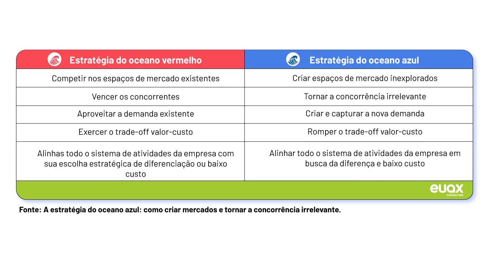
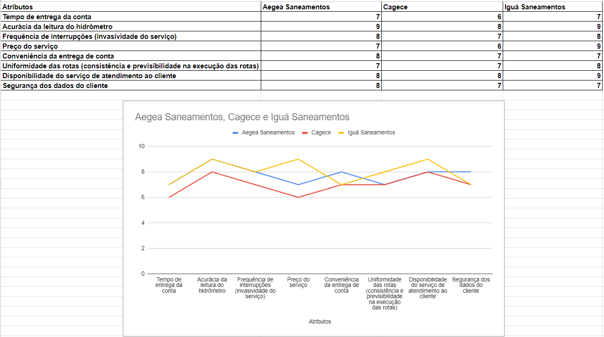
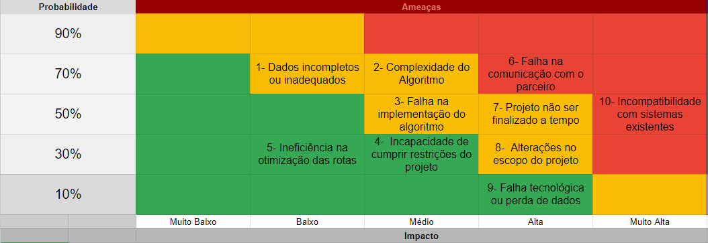
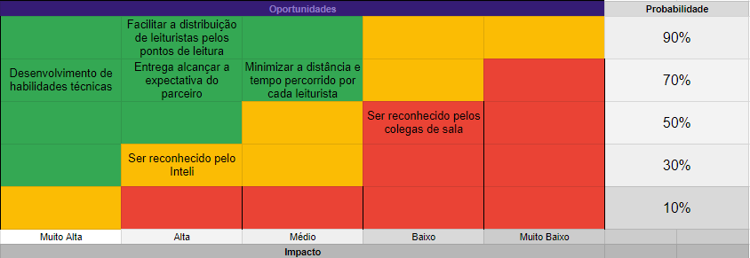

# Entendimento de negócio

## Sumário

[1. Oceano Azul](#c1) 
[2. Matriz de Riscos](#c2)
[3. Canvas Proposta de Valor](#c3)
[4. Análise Financeira](#c4)

## <a name="c1">1. Oceano Azul</a>

&emsp;Ao pensar no mundo empresarial, um fator fundamental e que irá designar o futuro da empresa é o poder competitivo com as suas concorrentes. Para que se tenha um bom posicionamento no mercado e saiba lidar com altos e baixos é preciso ter objetivos claros e descobrir novas tendências para se diferenciar dos demais. A estratégia do Oceano Azul é essencial na estruturação das ideias e exploração de novos setores.[1](#ref1)
Criado por W. Chan Kim e Renée Mauborgne após diversos anos de pesquisa, lançaram o livro ‘Blue Ocean Strategy – How to Create Uncontested Market Space and Make the Competition Irrelevant’ (Estratégia do Oceano Azul - Como criar novos mercados e tornar a concorrência irrelevante). Analisando que para superar a competitividade de uma empresa, não necessariamente é preciso superá-la a todo momento, é possível percorrer por outros mercados. [2](#ref2)

   <b>Figura 1 -</b> Oceano Vermelho x Oceano Azul

   

      </a>
   

   Fonte: Elaboração AeGeo

&emsp;Essa estratégia auxilia as empresas a repensar o espaço dela dentro do mercado atuante e a pesquisar por outros mercados novos ou ainda desconhecidos. Mesmo não sendo algo fácil desbravar novos mercados, o Oceano Azul pode ajudar as empresas a pensar em ideias disruptivas.
Aliando essa estratégia ao projeto realizado em conjunto com a Aegea, abaixo será realizado uma análise de atributos importantes para o parceiro e diferenciá-los da concorrência por meio das ações de Reduzir, Eliminar, Aumentar e Criar.

### Atributos importantes para os clientes

- Tempo de entrega da conta; [3]
- Acurácia da leitura do hidrômetro;
- Frequência de interrupções (invasividade do serviço);
- Preço do serviço;
- Conveniência da entrega de conta; [3]
- Segurança dos dados do cliente;
- Disponibilidade do serviço de atendimento ao cliente;
- Uniformidade das rotas (consistência e previsibilidade na execução das rotas). [3]

### Avaliação do Oceano Azul da Aegea

**Reduzir:**

- Tempo de entrega da conta: acelerar a entrega mediante as atualizações em tempo real;
- Preço do serviço: diminuir os custos através da eficiência operacional alcançada com rotas mais uniformes;
- Uniformidade das rotas: minimizar variações diárias na execução das rotas, simplificando a logística.

**Eliminar:**

- Interrupções frequentes: reduzir a frequência de interrupções dos clientes eliminando visitas presenciais onde possível;
- Papelada física: acabar com a necessidade de impressão de contas físicas, incentivando a adoção de métodos digitais.

**Aumentar:**
- Acurácia da leitura: reforçar a precisão das leituras com tecnologia ou remota;
- Segurança dos dados do cliente: implementar tecnologias avançadas de segurança cibernética;
- Disponibilidade do serviço de atendimento ao cliente: expandir a disponibilidade e capacidade do atendimento ao cliente.

**Criar:**
- Sistemas de leitura remota: inovar com tecnologias de leitura remota que não necessitam de visita do leiturista;
- Serviços de valor agregado: desenvolver serviços adicionais como monitoramento de consumo e consultoria para redução de desperdício;
- Uniformidade das rotas: estabelecer rotinas consistentes de leitura, onde os clientes saibam quando esperar a visita do leiturista, melhorando a previsibilidade e a satisfação do cliente.

#### Concorrentes

&emsp;A Aegea Saneamento é uma das principais empresas de saneamento básico do setor privado no Brasil, enfrentando a concorrência de diversas outras empresas no mercado. Entre seus concorrentes estão grandes nomes como Iguá Saneamento e consórcios formados por empresas como Marquise, GS Inima e PB Construções, além de Encalso, Terracom, Hidrosystem e CGD, que competem em licitações de Parcerias Público-Privadas (PPPs), como as da Companhia de Água e Esgoto do Ceará (Cagece).[4]

&emsp; Apesar de desafios e concorrência, a Aegea se destaca com uma estrutura robusta formada por instituições de peso, incluindo o fundo soberano de Cingapura GIC e o International Finance Corporation (IFC), do Banco Mundial. Essa composição permite que a Aegea capte recursos tanto no Brasil quanto no exterior, oferecendo-lhe uma vantagem competitiva substancial no setor​.[5]

&emsp; Abaixo encontra-se um gráfico onde é analisado e feito uma comparação entre a Aegea e algumas de suas diversas concorrentes (Cagece[6] e Iguá Saneamento[7]):

   <b>Figura 2 -</b> Análise de Concorrentes

   

      </a>
   

   Fonte: Elaboração AeGeo

&emsp;Diante da análise da Estratégia do Oceano Azul, percebe-se a relevância de redefinir a competição e explorar novos espaços de mercado. A abordagem de Reduzir, Eliminar, Aumentar e Criar (REAC) revela um caminho para diferenciação e inovação, alinhado aos atributos valorizados pelos clientes. Assim, a Estratégia do Oceano Azul não apenas oferece uma metodologia, mas também promove uma reinvenção contínua e a busca por oportunidades além dos limites tradicionais, moldando o futuro das organizações.

## <a name="c2">2. Matriz de Riscos</a> 

&emsp;A Matriz de Riscos, uma ferramenta comumente utilizada em projetos de metodologia ágil, é uma forma de mapear e mitigar potenciais riscos[7]. Esta ferramenta, que tem sido amplamente discutida por especialistas como Caroline Yamada dos Santos e Edson Alcebíades Spósito[8], funciona como um guia estratégico, sobre o que deve ser evitado e feito durante o projeto para assegurar que tudo transcorra de acordo com o planejado. Além de identificar possíveis riscos durante o desenvolvimento, a Matriz de Riscos ajuda a equipe a atingir as expectativas do parceiro. Assim, torna-se possível a realização do projeto e uma aproximação entre membros da equipe e stakeholders. A seguir é apresentada a matriz de risco desenvolvida com análise voltada para o projeto em questão.

   <b>Figura 3 -</b> Matriz de Riscos

   

      </a>
   

   Fonte: Elaboração AeGeo

&emsp;Segue uma explicação mais detalhada de cada risco identificado e as estratégias adotadas pelo grupo para sua mitigação:  

1. **Dados Incompletos ou Inadequados**: A falta de dados completos ou adequados pode levar a decisões mal informadas, comprometendo a eficácia do projeto.  
Estratégia: Realizar uma análise de dados inicial e solicitar ao parceiro mais dados, se necessário.

2. **Complexidade do Algoritmo**: A complexidade do algoritmo de otimização pode resultar em desempenho insatisfatório ou falhas.  
Estratégia: Planejar e testar cuidadosamente o algoritmo, considerando a escala de centenas de milhares de pontos.

3. **Falha na Implementação do Algoritmo**: Erros na implementação do algoritmo podem levar a resultados imprecisos ou falhas no sistema.  
Estratégia: Realizar testes rigorosos e revisões de código para garantir a correta implementação do algoritmo.

4. **Incapacidade de Cumprir Restrições do Projeto**: A incapacidade de cumprir as restrições do projeto (como dias de leitura, horas de trabalho diárias, etc.) pode resultar em falha do projeto.  
Estratégia: Monitorar de perto o progresso do projeto e ajustar o planejamento conforme necessário.

5. **Ineficiência na Otimização das Rotas**: Se as rotas otimizadas não resultarem em melhorias significativas na eficiência, o objetivo principal do projeto pode não ser atingido.  
Estratégia: Continuar aprimorando e ajustando o algoritmo de otimização até que os resultados desejados sejam alcançados.

6. **Falha na Comunicação com o Parceiro**: A falha na comunicação com o parceiro pode levar a mal-entendidos sobre os objetivos e expectativas do projeto.  
Estratégia: Manter uma comunicação clara e regular com o parceiro para garantir que todos estejam na mesma página.

7. **Projeto não ser Finalizado a Tempo**: O risco de não entregar o projeto a tempo pode comprometer a satisfação do parceiro.  
Estratégia: Planejar antecipadamente as entregas e monitorar de perto o progresso do projeto para garantir que ele esteja no prazo.

8. **Alterações no Escopo do Projeto**: Mudanças no escopo do projeto após o início do desenvolvimento podem levar a atrasos e aumento dos custos.  
Estratégia: Estabelecer um escopo claro e detalhado desde o início e se comunicar regularmente com o parceiro para evitar mudanças inesperadas.

9. **Falha Tecnológica ou Perda de Dados**: Problemas técnicos ou perda de dados podem interromper o progresso do projeto e resultar em atrasos.  
Estratégia: Implementar medidas de segurança de dados robustas e ter um plano de contingência para problemas técnicos.

10. **Incompatibilidade com Sistemas Existentes**: O algoritmo de otimização desenvolvido pode não ser compatível com os sistemas existentes do parceiro.  
Estratégia: Compreender completamente o ambiente técnico do parceiro antes do desenvolvimento e realizar testes de compatibilidade durante o processo.

&emsp;Além de mapear e mitigar os riscos, é essencial para o grupo conhecer as oportunidades que o projeto sendo desenvolvido pode trazer. Dessa forma, também desenvolvemos uma Matriz de Oportunidades em relação ao produto final.

 

   <b>Figura 4 -</b> Matriz de Oportunidades

   

      </a>
   

   Fonte: Elaboração AeGeo

 

&emsp;A Matriz de Oportunidades traz uma visão mais abrangente sobre os potenciais benefícios do desenvolvimento do projeto. Entre as oportunidades mais significativas, destacam-se: a otimização da distribuição dos leituristas pelos pontos de leitura da Aegea, permitindo um processo mais eficiente; o desenvolvimento de novas habilidades técnicas de membros do grupo, a partir de estudos e atividades relacionados ao projeto e, por fim, a entrega final alcançar as expectativas do parceiro. Essas oportunidades não apenas garantem melhorias operacionais para a Aegea, como também oferecem crescimento profissional para os membros da equipe, reforçando o valor do densenvolvimento do projeto.

&emsp;Por fim, as estratégias adotadas e implementadas pelo grupo refletem o comprometimento do grupo em mitigar riscos e maximizar o potencial do projeto. Através de planejamento, comunicação clara, e revisões, estamos não só antecipando desafios, mas também identificando e capitalizando em oportunidades. 

## 3. Canvas Proposta de Valor

&emsp;O Canvas Proposta de Valor é um framework usado para descrever um produto de maneira a destacar sua visão e como a solução resolverá o problema do cliente. Este modelo é dividido em duas partes distintas: a Proposta de Valor e o Segmento de Cliente. A primeira concentra-se no produto em si e em seus efeitos na situação, abrangendo os seguintes elementos: Criadores de Ganho (características do produto que promovem benefícios perceptíveis ao cliente), Aliviadores de Dores (atributos do produto que diminuem as preocupações do cliente) e Produtos e Serviços (características que definem o próprio produto). Por outro lado, a parte referente ao Segmento de Cliente tem foco na situação do cliente e como estas são impactadas pela situação atual, compreendendo também três elementos essenciais: Ganho (situações que proporcionam benefícios claros ao cliente), Dores (situações que evocam sensações desfavoráveis ao cliente) e Tarefas do Cliente (atividades que o cliente precisa realizar, independentemente da presença ou ausência da solução proposta). Para abordar o valor dessa estrutura, foi desenvolvido o seguinte Canvas Proposta de valor para o projeto em questão:

 Figura 5 - Value Proposition Canvas 

  

 Elaboração AeGeo 

&emsp; A seguir, são representados e explicados os tópicos descritos no modelo de Value Proposition Canvas acima.

**Tarefas do cliente** 
- Entender as capacidades dos leituristas: Os gestores devem ser capazes de entender quais rotas os leituristas são capazes de seguir, considerando suas características físicas.
- Os leituristas devem percorrer todas as casas cadastradas: A prioridade é fazer com que as rotas consigam preencher todas as casas, sem faltar a leitura em nenhum cliente.
- Os gestores devem planejar as rotas para os leituristas seguirem: A partir das casas e rotas previamente estabelecidas, a função dos gestores é entender a necessidade e disponibilidade dos leituristas para definir o local e datas que eles irão trabalhar.

**Dores** 
- Restrições de locomoção nas rotas: Os leituristas podem enfrentar desafios, como terrenos difíceis, restrições de tempo, e baixa efetividade de leitura.
- Desenvolver planos com objetivo de mitigar os problemas das rotas atuais: Os gestores de fluxo devem elaborar planos focados às rotas ineficientes pensando em suas possíveis falhas, ou seja, um trabalho que é focado nas falhas já existentes.
- Rotas ineficientes: Existem rotas em que os leituristas caminham sem a necessidade de passar com frequência, por terem sido projetadas para outro contexto.
- Utilizar rotas obsoletas: Os gestores de fluxo devem submeter rotas obsoletas pela falta de um recurso mais atual.

**Ganhos**
- Otimização de tempo para os funcionários: A otimização das rotas poupa um trabalho de pensar em como resolver os problemas que existiam.
- Tempo consideravelmente menor para as rotas: Considerando que as rotas não possuem a otimização necessária, o tempo é um artigo que pode caracterizar um serviço melhor.
- Maior produtividade para os gestores: A produtividade para os gestores refletem em resultados para a empresa.

**Aliviadores de dores**
- Maior facilidade na gestão das rotas planejadas: A partir do momento em que as rotas são mais íntegras e coesas, toda a gestão sobre elas é facilitada.
- Rotas menores e aproveitamento das regiões já visitadas: Rotas menores e otimizadas considerando todo o sistema de locais e aproveitando regiões já visitadas garante um tempo menor em cada rota e distâncias menores.
- Rotas mais versáteis: Geração de rotas mais versáteis que consideram possíveis dificuldades no caminho e as distâncias de forma mais atual
- Consideração das limitações dos leituristas: Limite de tempo para cada rota considerando a capacidade de caminhada dos leituristas e o tempo de deslocamento

**Produtos e Serviços**
- Frontend interativo: Frontend interativo que permite o acesso às rotas documentadas
- Lista de rotas definidas :Lista com os locais para visitação e seus respectivos números na sequência de visita
- Algoritmo de otimização: Algoritmo de otimização que calcula as rotas ideiais para os funcionários

**Criação de ganhos**
- Economias significativas: Como há novas rotas para que os gestores de fluxo possam garantir que os leituristas estejam utilizando seu tempo da maneira mais eficiente possível, isso pode levar a economias significativas para a empresa.
- Tempo menor para as rotas: Mais aproveitamento do tempo devido à existência de caminhos mais vantajosos e, consequentemente, um tempo menor para as rotas
- Foco em outras tarefas: Foco em outras tarefas que não incluem mais a resolução de problemas relacionados às rotas ineficientes
- Rotas mais seguras: Utilização de rotas mais seguras por considerar as menores travessias por ruas possíveis

&emsp;A elaboração da proposta de valor do projeto revelou pontos muito importantes para o desenvolvimento da solução e as dores do cliente a serem resolvidas, bem como os elementos necessários para isso. Nesse contexto, foi necessário voltar a atenção para as rotas estabelecidas atualmente e as dificuldades que os leituristas enfrentam pela estrutura atual delas. Ao direcionar o foco para os gestores desses fluxos, destaca-se a necessidade de uma ferramenta capaz de minimizar as complicações relacionadas às rotas, proporcionando-lhes uma margem maior para se concentrarem em outras áreas da gestão.

##  4. Análise Financeira

&emsp;&emsp;O projeto de otimização de rotas de leituristas da Aegea contém diversas etapas necessárias e custosas para que a solução desenvolvida seja aplicável em cenários práticos. Abaixo, estão destacados alguns desses fatores com seus respectivos custos projetados:

### Desenvolvimento da aplicação
&emsp;&emsp;A solução projetada depende de diversos componentes individuais que serão integrados. Dentre eles, a análise e o tratamento dos dados, o desenvolvimento do algoritmo aplicado nos dados do cliente, a criação de um back-end e APIs para o envio de dados processados pelo algoritmo e a elaboração de um front-end para consumir as requisições do back-end e apresentar resultados visuais são as principais tarefas da equipe de desenvolvimento. Dado o prazo de 10 semanas para uma equipe de 6 pessoas, o custo do desenvolvimento de tal solução estaria em torno dos **R$75.000,00**. Porém, visto que o desenvolvimento do projeto é feito como uma parceria com o Inteli com um propósito acadêmico, o custo acima projetado não se aplica.

### Hospedagem Cloud e Banco de Dados
&emsp;&emsp;Para que a aplicação esteja disponível para ser utilizada em qualquer lugar, com a criação constante de novas rotas criadas pelo algoritmo, é necessário que o serviço seja hospedado em algum provedor de serviços de computação cloud. Utilizando uma plataforma como a AWS, o custo do serviço varia de acordo com a demanda. Sendo essa uma ferramenta de uso interno na Aegea, provavelmente o serviço não teria mais de 2000 acessos diários, o que traria um custo de hospedagem de aproximadamente **R$100,00 por mês**.

### Treinamento adaptativo
&emsp;&emsp;Com uma nova aplicação presente no cotidiano dos gerentes de cadastro, um período de adaptação e aprendizado da ferramenta é fundamental para a produtividade futura do profissional. Pensando nisso, para que a longo prazo a aplicação seja rentável para a empresa, é necessário sacrificar no curto prazo um pouco da produtividade dos funcionários, o que diminuiria o fluxo de caixa mensal. 

### Integração com os sistemas já existentes
&emsp;&emsp;Outra adaptação necessária é a do próprio sistema já existente dentro da Aegea responsável por mapear as rotas e distribuir para os respectivos leituristas encarregados por cada região. Para que a solução seja utilizada de forma eficiente, é necessário uma integração que una ambos os sistemas de forma simples e intuitiva. Essa é uma etapa que pode demorar em média de 3 a 6 semanas em uma equipe de 3 pessoas, tendo um custo estimado de R$15.000,00 a R$25.000,00.

### Manutenção e atualizações
&emsp;&emsp;Para garantir a funcionalidade correta da aplicação, o ideal é que haja manutenções semestrais ou anuais realizadas por membros da equipe de desenvolvimento. Caso seja de interesse da Aegea, atualizações também podem ser realizadas para atender novas necessidades. Tendo em média 2 manutenções e 1 uma atualização significativa por ano, o custo estimado para manter a qualidade do software é de aproximadamente **R$5.000,00 por ano**. Vale destacar que, caso o cliente esteja satisfeito com o produto, os custos descritos são totalmente opcionais.

&emsp;&emsp;Como o MVP entregado será utilizado apenas dentro da Aegea, sem distribuição para outras empresas do setor, o projeto não gera receita, apenas maximiza o fluxo de caixa mensal e diminui a quantidade de horas extras pagas aos leituristas que precisaram de mais tempo para finalizarem seus respectivos trajetos. 

&emsp;&emsp;Em suma, o valor estimado para a entrega do projeto é de **R$90.000,00 a R$105.000,00**, com o custo anual de **R$1.200,00 a R$8.200,00**, conforme a necessidade do cliente.

# Referências
[1] PORTAL DRAFT. Blue Ocean ou Oceano Azul: conheça a estratégia utilizada pela Uber, Apple e YouTube. In: PORTAL DRAFT. Blue Ocean ou Oceano Azul: conheça a estratégia utilizada pela Uber, Apple e YouTube. [S. l.], 10 jun. 2019. Disponível em: https://www.napratica.org.br/blue-ocean-strategy-estrategia-do-oceano-azul/. Acesso em: 17 abr. 2024.

[2] ROVINA, Jackson. A estratégia do oceano azul: entenda por que o melhor jeito de vencer os concorrentes é parar de competir. In: ROVINA, Jackson. A estratégia do oceano azul: entenda por que o melhor jeito de vencer os concorrentes é parar de competir. [S. l.], 4 dez. 2019. Disponível em: https://www.euax.com.br/2019/12/a-estrategia-do-oceano-azul/#qual-a-estrategia-do-oceano-azul. Acesso em: 17 abr. 2024.

[3] INTELI (São Paulo). TAPI. In: INTELI. Aegea Saneamento e Participações S.A. [S. l.], 15 abr. 2024. Disponível em: restrito aos participantes do projeto. Acesso em: 18 abr. 2024.

[4] SANEAMENTO AMBIENTAL. Quatro concorrentes nas PPPs da Cagece, 26 set. 2024. Disponível em: https://saneamentoambiental.com.br. Acesso em: 24 abr. 2024.

[5] ISTOÉ DINHEIRO. Aegea vira a 2ª maior em saneamento no País, 09 jan. 2018. Disponível em: https://www.istoedinheiro.com.br. Acesso em: 24 abr. 2024.

[6] CAGECE. Perfil Corporativo. Disponível em: https://ri.cagece.com.br/en/about-cagece/corporate-profile/. Acesso em: 24 abr. 2024.

[7] IGUA SANEAMENTO. Disponivel em: https://igua.com.br/. Acesso em: 25 abr.2024

