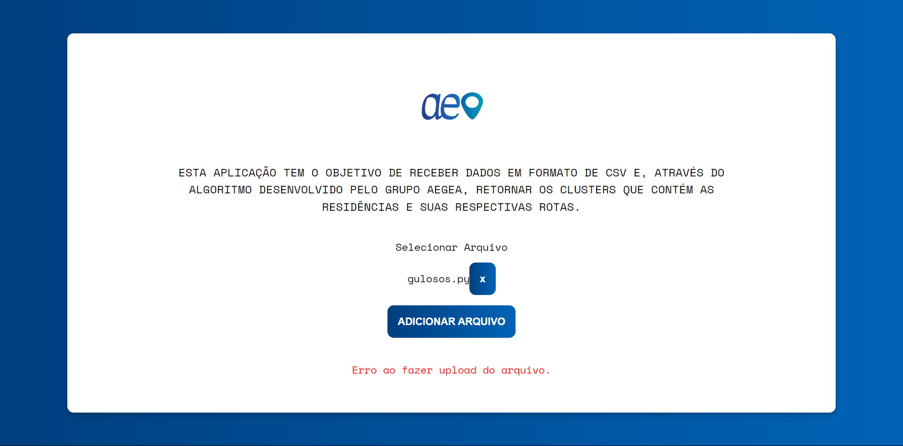
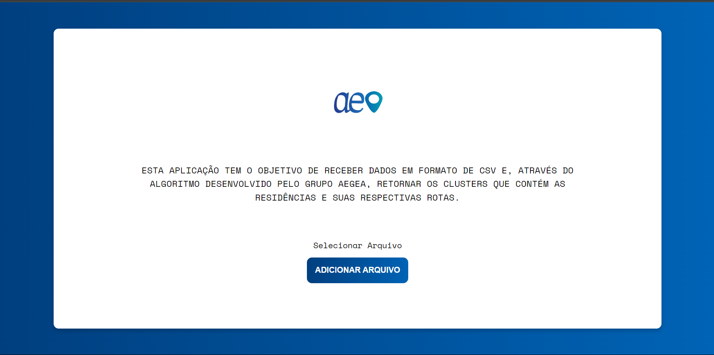

# Testes da Aplicação

## Introdução
Este documento descreve os testes realizados na aplicação frontend para garantir que todas as funcionalidades estejam funcionando conforme o esperado em conjunto com o backend do Aegeo. Os testes foram executados manualmente, fornecendo dados de entrada conhecidos e verificando se a resposta apresentada pela aplicação coincide com a resposta esperada.

## Testes da tela inicial

### 1. Teste de Upload de Arquivo CSV
**Descrição:** Verificar se o sistema permite o upload de um arquivo CSV e redireciona para a página de clusters após o sucesso.

**Entrada:** 
- Arquivo: `dados.csv` (um arquivo CSV válido)

**Saída Esperada:** 
- Mensagem de sucesso exibida.
- Redirecionamento para a página de clusters `/cluster`.
- Localização do arquivo salva no `localStorage`.

**Backend:** Chamada ao endpoint `POST /cluster`.

**Resultado:** 

 Figura 1 - Teste de upload 

  

- Sucesso.
- Observações: Supondo a adição de um arquivo. Usuário pode selecionar o arquivo, adicionar na aplicação para ser calculado o cluster e o algoritmo de rota ou trocar o arquivo.

### 2. Teste de Upload sem Selecionar Arquivo
**Descrição:** Verificar se o sistema exibe uma mensagem de erro quando tenta fazer upload sem selecionar um arquivo.

**Entrada:** 
- Nenhum arquivo selecionado.

**Saída Esperada:** 
- Mensagem: "Por favor, selecione um arquivo."

**Backend:** Nenhuma chamada ao backend.

**Resultado:** 

 Figura 2 - Teste de falha de upload

  

- Sucesso.

- Observações: Nesse teste foi adicionado um arquivo '.py' que não faz sentido para aplicação, ou seja, a aplicação deve receber somente arquivo '.csv', como mostrado na imagem, foi retornado um erro de upload.

### 3. Teste de Remoção de Arquivo
**Descrição:** Verificar se o sistema permite remover um arquivo selecionado antes de fazer o upload.

**Entrada:** 
- Arquivo: `dados.csv` (selecionado)
- Clique no botão de remover (`x`)

**Saída Esperada:** 
- Arquivo removido da seleção.
- Entrada de arquivo disponível para selecionar um novo arquivo.

**Backend:** Nenhuma chamada ao backend.

**Resultado:** 

 Figura 3 - Teste de Remoção de arquivo

  

- Sucesso.

- Observações: Ao adicionar um arquivo, é possível excluir e selecionar outro clicando no 'x' que aparece ao lafdo do arquivo selecionado.

## Testes da tela do Cluster

### 4. Teste de Carregamento de Dados
**Descrição:** Verificar se os dados de clusters são carregados corretamente após a montagem do componente.

**Entrada:** 
- Nenhuma entrada específica (a API `/cluster` deve retornar dados válidos).

**Saída Esperada:** 
- Dados de clusters carregados e exibidos no mapa.
- Exibição dos detalhes dos clusters, como número de clusters, tempo de execução e distância média.

**Backend:** Chamada ao endpoint `POST /cluster`.

**Resultado:** 

 Figura 4 - Carregamento de dados

  

- Sucesso.

- Observações: Após o usuário inserir o arquivo, ele será redirecionado para a página de clusters.

### 5. Teste de Exibição de Clusters no Mapa
**Descrição:** Verificar se os clusters são exibidos corretamente no mapa com seus respectivos círculos.

**Entrada:** 
- Dados de clusters válidos retornados da API.

**Saída Esperada:** 
- Círculos representando os clusters exibidos corretamente no mapa.

**Backend:** Chamada ao endpoint `POST /cluster`.

**Resultado:**

 Figura 5 - Teste de exibição de clusters

  

- Sucesso.
- Observações: Na imagem é possíve ver 2 clusters, resultado do arquivo inserido pelo usuário. Sendo diferenciados pela cor e o quadro ao lado com dados de número de cluster, tempo de execução e distância.

### 6. Teste de Navegação ao Clicar no Cluster
**Descrição:** Verificar se a aplicação navega para a página de algoritmo ao clicar em um cluster no mapa.

**Entrada:** 
- Clique em um círculo representando um cluster no mapa.

**Saída Esperada:** 
- Navegação para a página `/algoritmo`.

**Backend:** Nenhuma chamada ao backend.

**Resultado:** 

 Figura 6 - Teste navegação ao clicar no cluster

  

- Sucesso.
- Observações: Ao clicar em um cluster é inserido um 'card' para confirmação do usuário e também no mapa um número de rotas dentro do cluster.

## Testes da tela do Algoritmo de rota

### 7. Teste de Carregamento Inicial de Dados de Otimização
**Descrição:** Verificar se os dados de otimização são carregados corretamente ao montar o componente.

**Entrada:** 
- Nenhuma entrada específica (a API `/optimize` deve retornar dados válidos).

**Saída Esperada:** 
- Distância inicial (`distInicial`) carregada.
- Rota (`route`) carregada e exibida no console.

**Backend:** Chamada ao endpoint `POST /optimize` com `cluster_index` 0.

**Resultado:** 

 Figura 7 - Teste de carrgamento inicial de otimização

  

- Sucesso.

- Observações: Na imagem é mostrado o mapa ainda vazio e as rotas sendo calculadas.

### 8. Teste de Carregamento Inicial de Pontos
**Descrição:** Verificar se os pontos de coordenadas são carregados corretamente ao montar o componente.

**Entrada:** 
- Nenhuma entrada específica (a API `/optimize` deve retornar dados válidos).

**Saída Esperada:** 
- Pontos (`points`) carregados e exibidos no console.

**Backend:** Chamada ao endpoint `POST /optimize`.

**Resultado:** 

 Figura 8 - Teste de Carregamento inicial dos pontos

  

- Sucesso.
- Observações: Todas as rotas do cluster são carregadas e uma tabela é carregada com todos os pontos, além de conter as rotas divididas pelos 22 dias que os roteiristas devem trabalhar.

### 9. Teste de Exibição de Pontos no Mapa
**Descrição:** Verificar se os pontos são exibidos corretamente no mapa.

**Entrada:** 
- Dados de pontos válidos retornados da API.

**Saída Esperada:** 
- Marcadores exibidos no mapa nas posições corretas.

**Backend:** Chamada ao endpoint `POST /optimize`.

**Resultado:** 

 Figura 9 - Teste de exibição de pontos

  

- Sucesso.

- Observações: Nessa imagem é mostrada a rota do 'grupo 3', ou seja, terceiro dia do roteirista.

## Futuras implementações na aplicação

### 7. Teste de Erro no Carregamento de Dados - Clusterização
**Descrição:** Verificar se o sistema lida corretamente com erros ao carregar os dados de clusters.

**Entrada:** 
- Simular uma falha na API `/cluster`.

**Saída Esperada:** 
- Mensagem de erro exibida na interface.

**Backend:** Chamada ao endpoint `POST /cluster` que retorna um erro.

**Resultado:** 

### 12. Teste de Erro no Carregamento de Dados de Otimização - Otimização
**Descrição:** Verificar se o sistema lida corretamente com erros ao carregar os dados de otimização.

**Entrada:** 
- Simular uma falha na API `/optimize`.

**Saída Esperada:** 
- Mensagem de erro exibida no console.

**Backend:** Chamada ao endpoint `POST /optimize` que retorna um erro.

**Resultado:** 

### 13. Teste de Erro no Carregamento de Pontos - Otimização
**Descrição:** Verificar se o sistema lida corretamente com erros ao carregar os pontos de coordenadas.

**Entrada:** 
- Simular uma falha na API `POST /optimize`.

**Saída Esperada:** 
- Mensagem de erro exibida no console.

**Backend:** Chamada ao endpoint `POST /optimize` que retorna um erro.

**Resultado:** 

## Conclusão
Este documento contém uma descrição detalhada dos testes realizados na aplicação, incluindo os dados de entrada, a saída esperada e os resultados obtidos, além de futuros testes que não foram implementados, mas que seriam pontos importantes para a navegação do usuário na aplicação. A execução desses testes é essencial para garantir a qualidade e a funcionalidade da aplicação.
