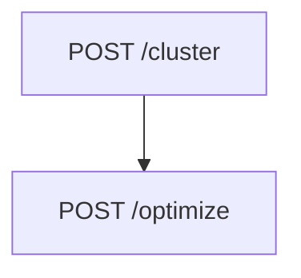

# Backend do Grupo 6
O objetivo deste README é explicar como executar o backend. Também trazemos alguns outros pontos relevantes sobre a API.

## Executando a aplicação
### Preparo do Ambiente
```sh
cd codigo/backend # 1: entre no diretório do backend
python -m venv ./.venv # 2: crie um venv
source .venv/bin/activate # 3: ative o venv
pip install -r requirements.txt # 4: instale os pacotes necessários
```

### Executando em Desenvolvimento
```sh
fastapi dev main.py
```

### Executando em Produção
> :warning: verifique o comando para a configuração específica do seu servidor. [Docs](https://docs.gunicorn.org/en/22.0.0/run.html).

```sh
gunicorn -w 4 main:app
```

## Fluxo de chamadas da aplicação
Os endpoints da aplicação foram feitos para serem executados em uma ordem específica:



### Endpoint: /cluster
O endpoint `/cluster` recebe um body no formato `form-data` com um campo chamado `file` que deve conter um arquivo CSV delimitado por `;` no formato abaixo
```
INDICE;LATITUDE;LONGITUDE;CODIGO_ROTA;SEQUENCIA;LOGRADOURO;NUMERO
```

### Endpoint: /optimize
O endpoints `/optimize` recebe apenas um campo como query string/param chamado `cluster_index` que deve conter o número do cluster cujas rotas devem ser optimizadas.